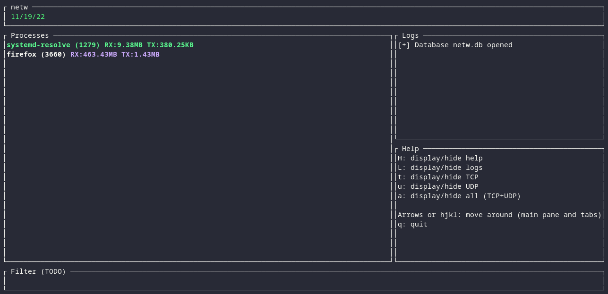

# NETW

The network watcher.



## What?

Record network traffic (connections, amount of data transferred) per process and
per connection.

Ideally it should be able to block certain connections.
* how?
* as a backend of `opensnitch`?

Well, I hadn't noticed but it's been a year now that `opensnitch` added support
to eBPF to capture packets... The only thing `netw` does differently is to
keep track of the amount of data being transferred.

Just use that: https://github.com/evilsocket/opensnitch

## Status

Working version. Last tested kernel: `5.19` (Fedora 36).

* Display processes communicating over the network
* Display amount of data transferred per link and per process
* All links are displayed, wether currently established or not
* TCP and UDP, IPv4 and IPv6


## How to use

Run:

```bash
cargo build

# Start a daemon to continuously populate the DB
sudo ./target/debug/sekhmet -m daemon

# Start the UI (real-time if daemon running or static content of the DB is one
# exists
sudo ./target/debug/sekhmet -m ui
```

Unit tests:

```bash
# --test-threads=1 important otherwise fails occasionaly because of the global
# vector containing the processes being empty when accessed. Only an issue when
# test cases are run concurrently.
cargo test -- --test-threads=1
```

To test that you actually intercept something:

```bash
cd tests
sudo ./simulate_traffic.sh
```
